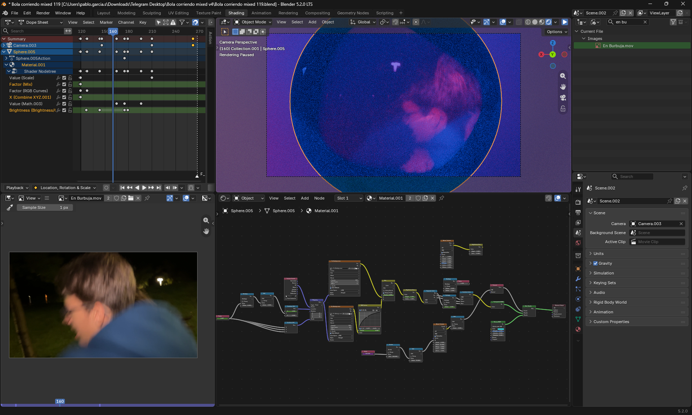
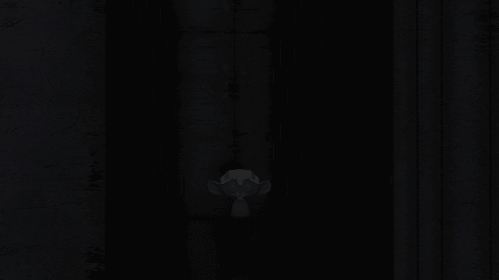

import VideoCompareSlider from '../../components/VideoCompareSlider.astro';

Internamente yo categorizaba aquellas escenas que requerían cambiar el flujo de trabajo común de otras escenas las categorizaba como “Atención especial”. 

Estás son las que más relevantes han sido para mí:

## Recuperación del tracking con IA (CoTracker)

La razón principal de los problemas del tracking fue que la conexión entre el iPhone y el ordenador con Unreal no era estable, lo que hacía que en medio de la toma se perdieran keyframes de la cámara.

Fue el mayor problema de todo el rodaje, y en las escenas se nota bastante.

Como lo detecté en postproducción, tuve que investigar cómo recuperar la toma, y encontré un modelo de Facebook llamado [CoTracker3](https://cotracker3.github.io/) que trackea puntos mediante IA.

[Modifiqué la demo oficial](https://huggingface.co/spaces/PGSCOM/cotracker/commits/main) para que admitiera mejor calidad y la ejecuté en mi ordenador, y luego, importé el video a Blender y trackee los puntos que generó el video de la demo.

> Esto no fue la manera más profesional de hacerlo, podría haber sustituido el motor de tracking de Blender directamente, pero no tenía mucho tiempo para las dos tomas que lo necesitaban.

<VideoCompareSlider beforeSrc="/proyvid/multiguerras/escenas/cotracker/despues.mp4" afterSrc="/proyvid/multiguerras/escenas/cotracker/antes.mp4"/>

## Escena corriendo

Esta escena fue construida con nodos de shading en Blender.

<video src="/proyvid/multiguerras/escenas/bolacorriendo.mp4" muted preload="none"></video>

### Referencia
En el entorno me inspiré en una escena del final de la película "Flow". Ver [aquí](/assets/flow.png)

## Escena explosión muro
Hay una escena donde un muro explota. Y en esa escena lo que hice fue simular la explosión y humos en Blender y luego renderizar esa escena en dos:

- En Blender: rendericé humo y partículas con los otros elementos como shadow catcher
- En Unreal importé los movimientos de las piezas como un FBX animado (convertido y exportado desde Blender) y rendericé la escena sin más cambios
<VideoCompareSlider beforeSrc="/proyvid/multiguerras/escenas/explosion/despues.mp4" afterSrc="/proyvid/multiguerras/escenas/explosion/antes.mp4" beforeLabel="Final" afterLabel="Blender" />

<video src="/proyvid/multiguerras/explosionmuro.mp4" muted preload="none" autoplay style="width: 75%;"></video>

## Primer plano cárcel
La compuse a partir de dos tomas del jefe a las que les quité el fondo y metí dentro de la jaula.

<video src="/proyvid/multiguerras/escenas/carcelprimer.mp4" muted preload="none"></video>

 

### Referencia

Usé como referencia para esta escena el efecto de carcel de Spider-Man Across the Spider-Verse:

<iframe data-yt-loop-start="76" width="100%" style="aspect-ratio:16/9;height:auto;max-width:480px" src="https://www.youtube.com/embed/b_yMOiRgMmQ?start=76&end=78&mute=1" title="YouTube video player" frameborder="0" allow="autoplay; clipboard-write; encrypted-media; picture-in-picture; web-share" referrerpolicy="strict-origin-when-cross-origin" allowfullscreen></iframe>

## Final del jefe volando

Tuve que hacer esta escena en Blender porque incluía un escaneo de Gaussian Splatting que tenía que renderizar en EEVEE. Así que hice la escena renderizando primero una parte en cycles y luego superponiendo la parte de EEVEE para meter el Gaussian Splatting. 

<video src="/proyvid/multiguerras/escenas/jefeflotando.mp4" muted preload="none"></video>
<VideoCompareSlider beforeSrc="/proyvid/multiguerras/escenas/jefevolando/despues.mp4" afterSrc="/proyvid/multiguerras/escenas/jefevolando/antes.mp4" beforeLabel="EEVEE + Cycles" afterLabel="EEVEE" />

(Aunque hubiera sido más fácil haber importado el modelo de Gaussian splatting a Unreal y trabajar desde ahí)