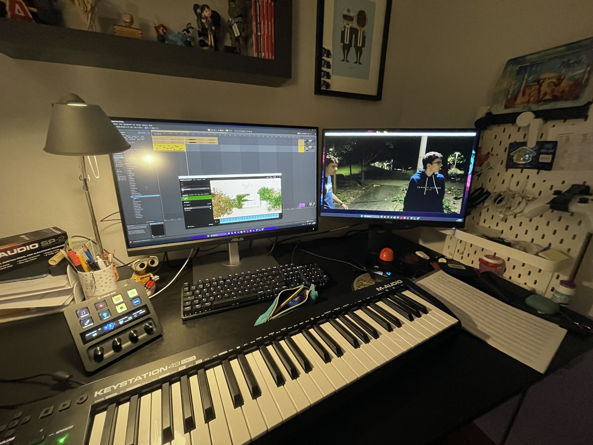
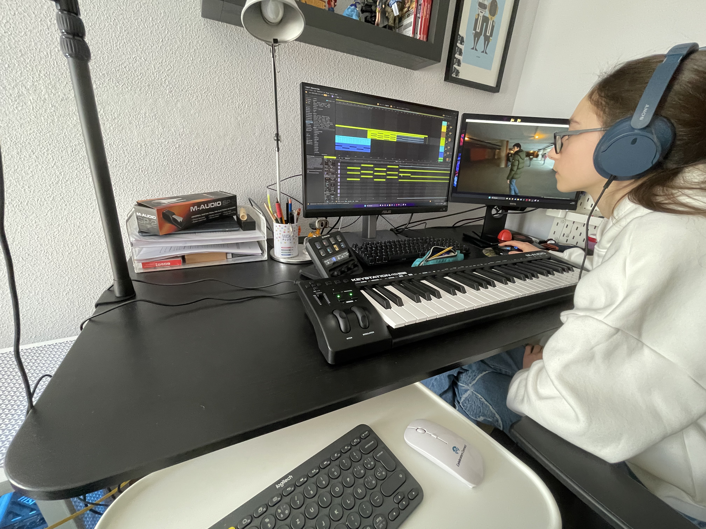

Esperé a montar todo el cortometraje para editar el sonido. Casi todo el sonido fue hecho con [Ableton Live](https://www.ableton.com/es/live/) donde importé una previsualización de cada grupo de escenas del cortometraje.

## Banda sonora y efectos de sonido
En cuanto a la Banda Sonora Original, se hizo con diversos VSTs como Kontakt y demás. La mayor parte de las canciones fueron compuestas e interpretadas por Encarnación Arce; yo ejercí de productor y la guié en Ableton, que ella no había utilizado antes. La canción final fue la única que compuse íntegramente yo, que está construida a base de configurar sintetizadores.
Publiqué cada canción en Spotify y demás plataformas, se puede escuchar también en [YouTube](https://www.youtube.com/playlist?list=OLAK5uy_ljUXwq9glHtZlRdZe-q-VoQDu_t0duN0k).

<video src="/proyvid/multiguerras/bandasonora.mp4" preload="none"></video>

Luego, para los efectos de sonido, lo hice con el mismo programa y sintetizadores personalizados para cada efecto.

Por ejemplo, para el sonido de la bomba, lo hice grabando un bote de Actimel lleno de lentejas.