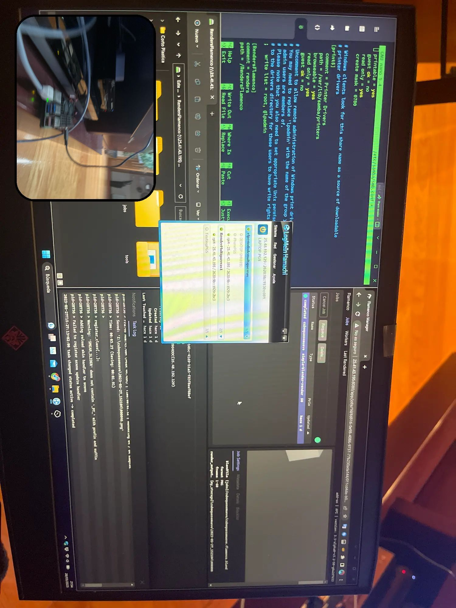

## Hecho y renderizado en Blender:

<video src="/proyvid/multiguerras/escenas/tv.mp4" muted preload="none"></video>
<video src="/proyvid/multiguerras/escenas/bolacorriendo.mp4" muted preload="none"></video>
<video src="/proyvid/multiguerras/escenas/guerratiro.mp4" muted preload="none"></video>
<video src="/proyvid/multiguerras/escenas/jefeflotando.mp4" muted preload="none"></video>
<video src="/proyvid/multiguerras/escenas/carcel.mp4" muted preload="none"></video>
<video src="/proyvid/multiguerras/escenas/bolaportal.mp4" muted preload="none"></video>

## Portal (en Blender)

El primer intento del portal fue con un sistema de "rastro de humo" que no acabó de convencer.

Luego mi compañero Aarón me enseñó a usar los modificadores "Malla a volumen". Y junto al modificador "Desplazar volumen" el efecto quedó resuelto.

Trasladé esta versión a Unreal, que se puede ver
[aquí](#portales).

## Simulaciones

Los assets que requerían simulación de humos (excepto el portal en su mayoría de ocasiones) los hice con Blender.

<video src="/proyvid/multiguerras/bolaportal.mp4" muted preload="none"></video>
<video src="/proyvid/multiguerras/escenas/bolaportal.mp4" muted preload="none"></video>

También hay escenas con simulaciones más grandes que estas, como la [escena de la explosión del muro de Berlín](#escena-explosión-muro)

## Render Farm (De Flamenco a SheepIt)
Al principio, para renderizar todas las simulaciones de Blender configuré un servidor de [Flamenco](https://flamenco.blender.org/) en una RPI4.

### Compilación
Tuve que compilar el servidor de Flamenco en la RPI4 (ARM) lidiando con varias dependencias del makefile. Consulté a la comunidad de Blender y me ayudaron a ello.

### Por qué no se utilizó
Flamenco funciona de tal manera que cada Worker (PC renderizador) tiene que tener acceso con VPN a la RPI4 y acceso a un servidor de samba.

Todo esto lo conseguí, incluso hice un script para ejecutar el worker de Flamenco, pero el problema fue que no capté suficientes personas para renderizar (3 personas). Así que al final opté por [Sheepit Renderfarm](https://www.sheepit-renderfarm.com/), en la que hace tiempo rendericé para otra gente y ahora tengo puntos para que otros rendericen por mí y los que me quieren apoyar pueden renderizar con las Render Keys.