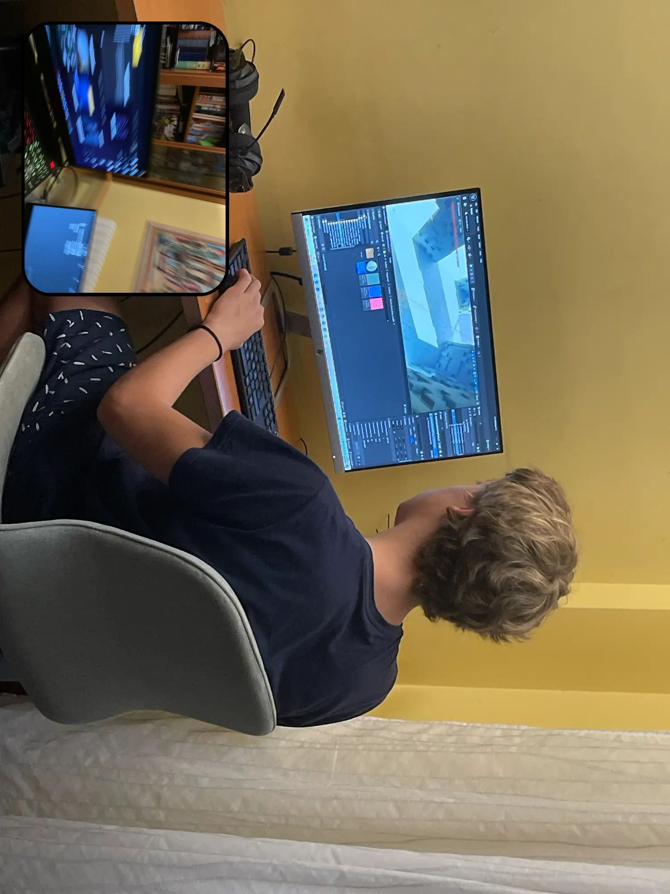
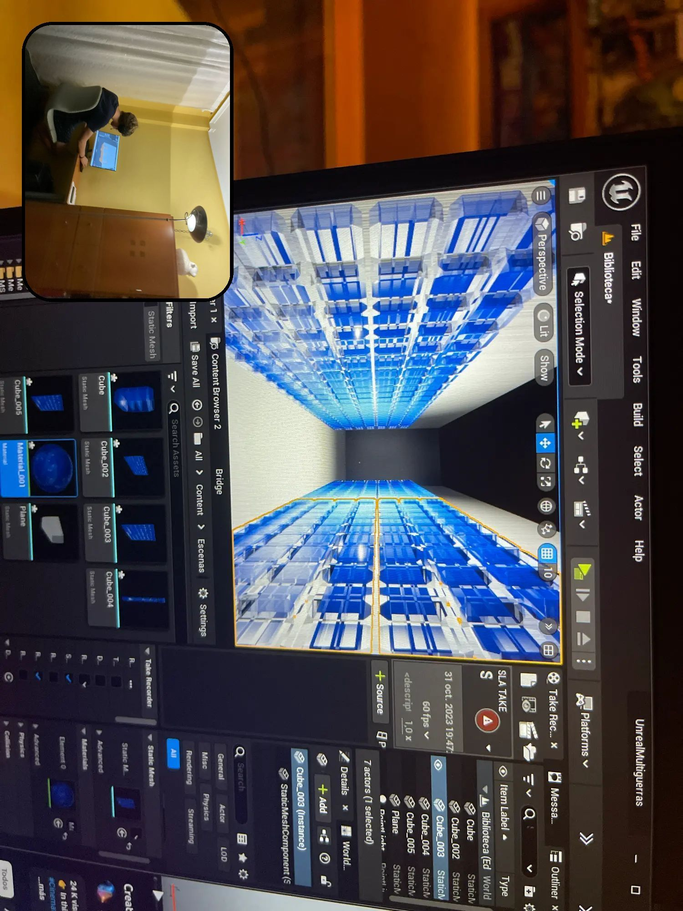

## Modelado

### Diseño de escenarios (TODO SECCIÓN NUEVA)
Antes de la grabación, se modelaron los escenarios en Blender y luego se importaron a Unreal Engine 5.

(TODO Cambiar el texto de la escena por directamente una imagen sobre ello (galería))

Fueron hechos en Blender los escenarios: Central, Sala de entrenamiento y Cárcel

Y fue hecho y renderizado totalmente en Blender las escenas: Final del jefe volando, tomas de primer plano de la cárcel y gente corriendo dentro de una bola.

## Portal

El portal primero se hizo en Blender con simulación de humos y los modifier “Malla a volumen” y “Desplazar volumen” se conseguía hacer este efecto.

(TODO IMAGEN PORTAL)

Esta versión fue traspasada a Unreal que se puede ver
[aquí](TODO SECCIÓN PORTAL EN UNREAL).

## Simulaciones

Los assets que requerían simulación de humos (excepto el portal en su mayoría de ocasiones) fueron hechos con Blender.

(TODO IMAGEN BOLA PORTAL)

También hay escenas con simulaciones más grandes que estas, como la [Escena de la explosión del muro de Berlín](TODO ENLACE A SECCIÓN)

(TODO NUEVA SECCIÓN)
## Escenas con “Atención especial”

Internamente yo categorizaba aquellas escenas que requerían cambiar el flujo de trabajo común de otras escenas las categorizaba como “Atención especial”. 

Estás son las que más relevantes han sido para mí:

### Escena corriendo dentro de una bola

Esta escena fue una experimentación con los nodos en Blender.

(TODO IMAGEN)

### Escena explosión muro
Hay una escena donde un muro explota. Y en esa escena lo que hice fue simular la explosión y humos en Blender y luego renderizar esa escena en dos:

- En Blender: se renderiza humo y partículas con los otros elementos como shadow catcher
(TODO IMAGEN BLENDER)
- En Unreal se importaron los movimientos de las piezas como un FBX animado (convertido y exportado desde Blender) y se renderizó la escena sin más cambios
(TODO IMAGEN UNREAL)

### Primer plano cárcel

### Final del jefe volando

Esta escena hubo que hacerla en Blender porque incluía un escaneo de Gaussian Splatting que se tenía que renderizar en Eevee. Así que se hizo esa escena renderizando primero una parte en cycles y luego se superponía la parte de Eevee para meter el Gaussian Splatting. 

(TODO IMAGEN)

(Luego pensándolo hubiera sido más fácil haber importado el modelo de Gaussian splatting a Unreal y trabajar desde ahí)