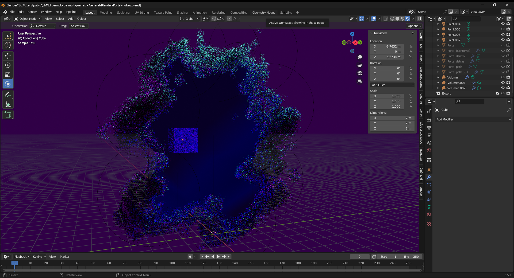

## Hecho y renderizado en Blender:

<video src="/proyvid/multiguerras/escenas/tv.mp4" muted preload="none"></video>
<video src="/proyvid/multiguerras/escenas/bolacorriendo.mp4" muted preload="none"></video>
<video src="/proyvid/multiguerras/escenas/guerratiro.mp4" muted preload="none"></video>
<video src="/proyvid/multiguerras/escenas/jefeflotando.mp4" muted preload="none"></video>
<video src="/proyvid/multiguerras/escenas/carcel.mp4" muted preload="none"></video>
<video src="/proyvid/multiguerras/escenas/bolaportal.mp4" muted preload="none"></video>

## Portal (en Blender)

El portal primero se hizo en Blender con simulación de humos y los modifier “Malla a volumen” y “Desplazar volumen” se conseguía hacer este efecto.

Esta versión fue traspasada a Unreal que se puede ver
[aquí](TODO SECCIÓN PORTAL EN UNREAL).

## Simulaciones

Los assets que requerían simulación de humos (excepto el portal en su mayoría de ocasiones) fueron hechos con Blender.

<video src="/proyvid/multiguerras/bolaportal.mp4" muted preload="none"></video>
<video src="/proyvid/multiguerras/escenas/bolaportal.mp4" muted preload="none"></video>

También hay escenas con simulaciones más grandes que estas, como la [Escena de la explosión del muro de Berlín](TODO ENLACE A SECCIÓN)

## Render

## Flamenco

### ¿Qué es?

### Instalación

### Compilación

### Raspberry Pi

### Workers

### Funcionamiento

Poner esquema.

## SheepIt

¿Por qué cambiar?

Ventajas.

Economía de puntos.

Google Colab.
