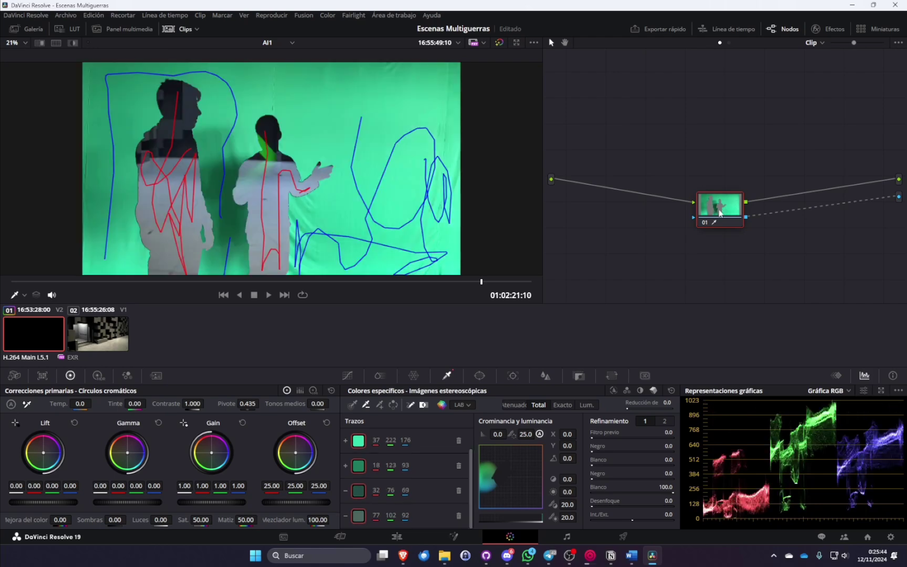

## PostgreSQL

Varias personas tenían que trabajar sobre el mismo proyecto de Resolve, así que monté PostgreSQL + pgAdmin en la RPI4, accesible por VPN (ver [detalles en Infraestructura](infraestructura#postgresql)).

## VFX

### Metadatos
Usé la claqueta virtual de la cámara para determinar la escena y toma que se estaba grabando. 
Y también, gracias al metadato del objetivo sabía qué cámara había que configurar en Unreal.

### Composición
Con los metadatos extraídos desde Unreal a CSV (proceso explicado [aquí](#emparejamiento-de-tomas-reales-y-virtuales)) metía las dos tomas con el mismo metadato de escena en una secuencia multicámara y luego la copiaba a una timeline donde se aplicaba la pantalla verde, corrección de color y VFX que necesitara esa escena.

#### Montaje:

Ya que cada escena estaba en su respectiva Timeline, solo tenía que arrastrarla en una timeline master.
