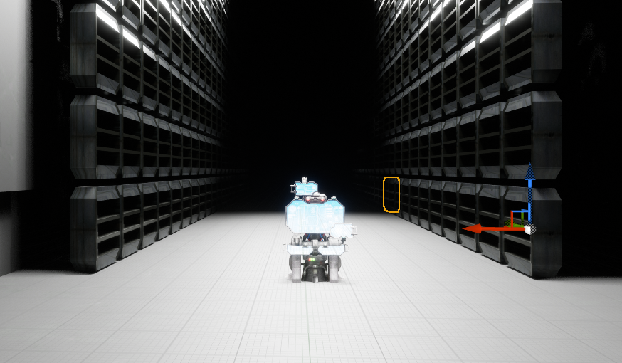
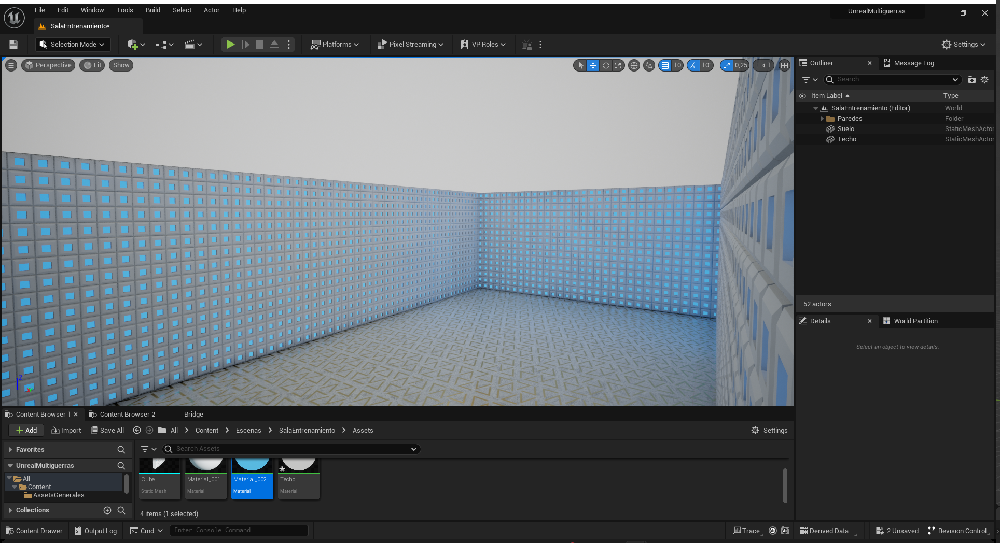
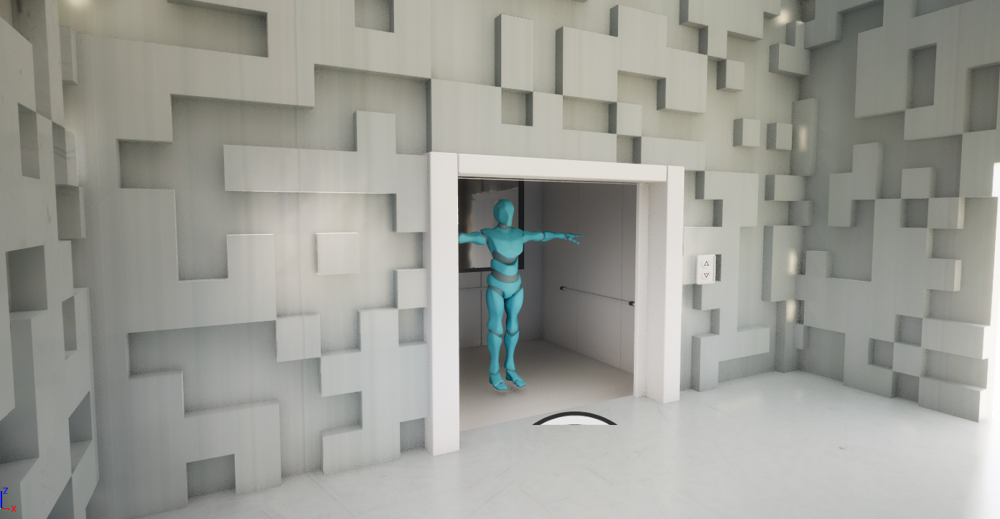
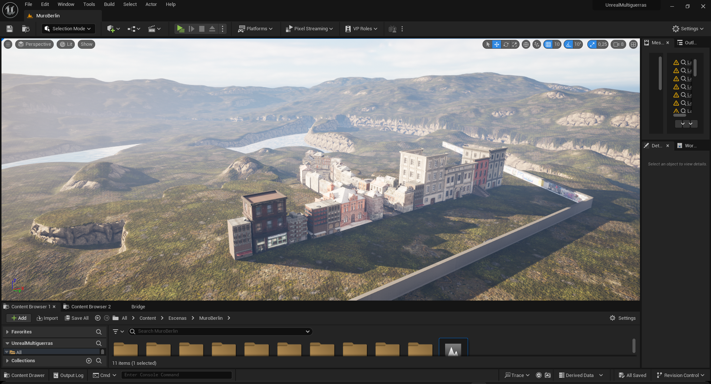
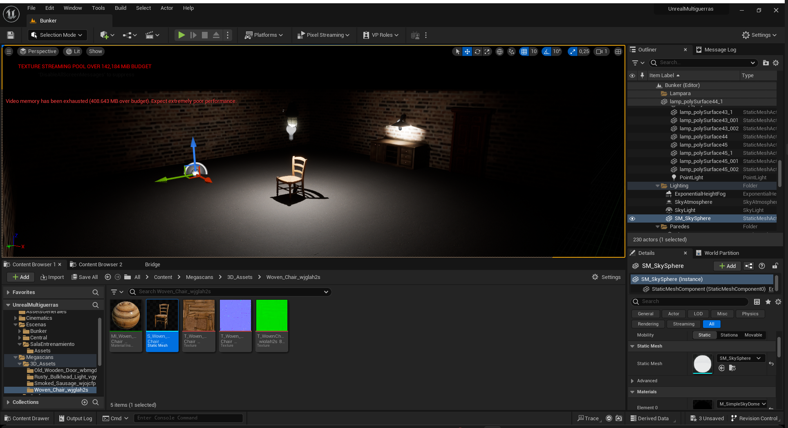

Antes de la grabación, modelé los escenarios en Blender y luego los importé a Unreal Engine 5 con el plugin [BlenderTools](https://github.com/EpicGames/BlenderTools) para Unreal. En la central recibí ayuda de mi compañero Aarón para modelar la escena.

## Diseñados en Blender

## Diseñados en Unreal

Algunos escenarios los monté mayoritariamente en Unreal usando sus herramientas como modificadores de terreno.

