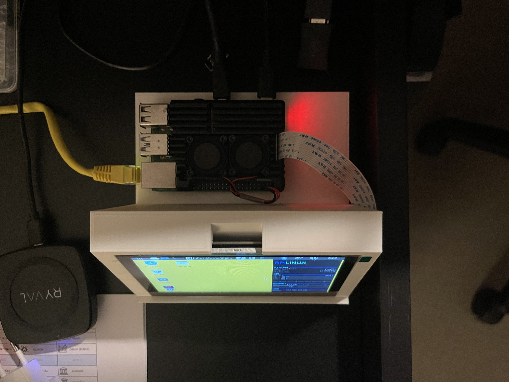
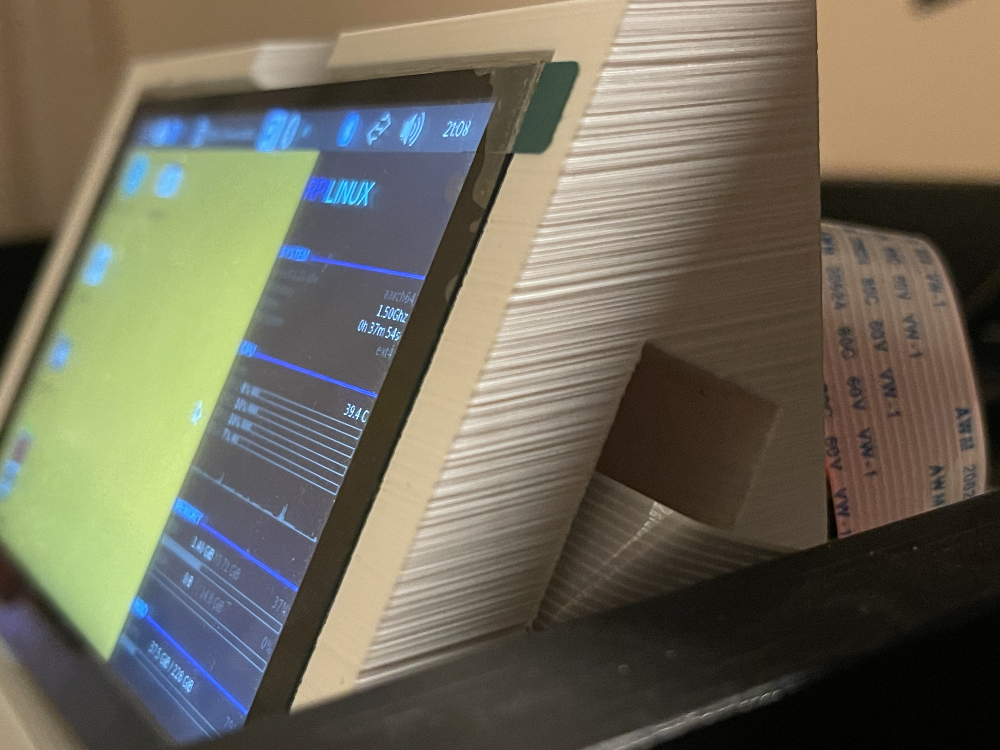

Al empezar, se empezó a crear:

- La [Renderfarm de Flamenco](#render-farm-de-flamenco-a-sheepit) con la RPI4 conectada a una VPN de Zero Tier (Actualmente uso Tailscale)
- La [Organización de Github](https://github.com/multiguerras) para gestionar el código y los repositorios de cada proyecto.

Después, Github se me quedó corto con la gestión de archivos grandes del proyecto de Unreal, así que migré a [Gitea](https://gitea.com/) para guardar todo de forma local en la RPI4.

### Almacenamiento:
Y en cuanto al almacenamiento, usaba Samba para compartir los archivos de [Flamenco](https://flamenco.blender.org/) pero al final no se usó. Y para compartir los archivos, renderizados y demás se usó [Syncthing](https://syncthing.net/) cuando había que copiar los archivos y la función de compartir archivos de Windows cuando solo se necesitaba acceder puntualmente. Todo estaba guardado en mi ordenador y hacía copias de seguridad recurrentes.

## Raspberry Pi

### Carcasa
Esta carcasa fue diseñada en FreeCAD y impresa en 3D.

<iframe title="Carcasa pantalla rpi4 5''" frameborder="0" allowfullscreen mozallowfullscreen="true" webkitallowfullscreen="true" allow="autoplay; fullscreen; xr-spatial-tracking" xr-spatial-tracking execution-while-out-of-viewport execution-while-not-rendered web-share width="100%" height="450" src="https://sketchfab.com/models/a03612f7b3c34259a1534b39a76d5e55/embed?autostart=1&annotations_visible=0&preload=1&annotation_cycle=4&dnt=1"> </iframe>

<video src="/proyvid/multiguerras/rpi4carcasa.mp4" muted preload="none"></video>

### Inicio remoto
Como la RPI4 se inicia nada más enchufarla a la corriente, le metí un [enchufe inteligente](https://www.philips-hue.com/es-es/p/hue-smart-plug/8719514342309) que se podía encender y apagar desde Google Home.

### Servicios

- PostgreSQL (Para gestionar los proyectos de Resolve)
- [Flamenco](https://flamenco.blender.org/) (Renderfarm antigua)
- [Gitea](https://about.gitea.com/) para gestión de repositorios
- Servidor de archivos SAMBA

## VPNs

### [Hamachi](https://vpn.net/)

- Usado en primeras pruebas
- No se usó por limitación de 5 dispositivos/red.

### [ZeroTier](https://www.zerotier.com/)

- 25 dispositivos/red (En el momento de usarlo)

## Automatizaciones

Se han usado diversos scripts de python para automatizar tareas repetitivas.
Un ejemplo bastante importante es el script encargado de generar el CSV con los metadatos de las escenas de Unreal. Su repo es [este](https://github.com/multiguerras/TimecodeUnreal).