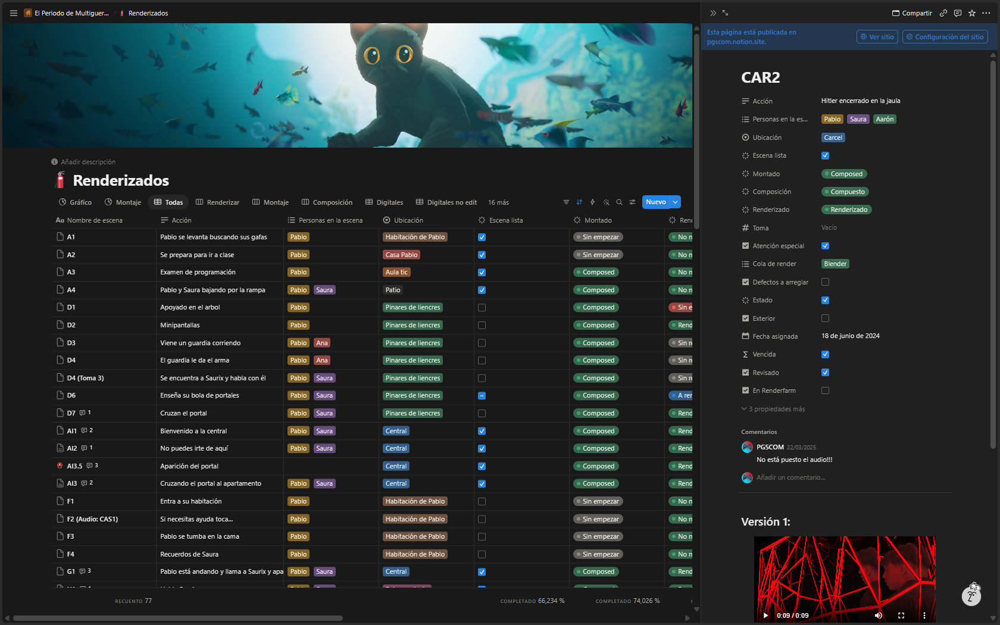
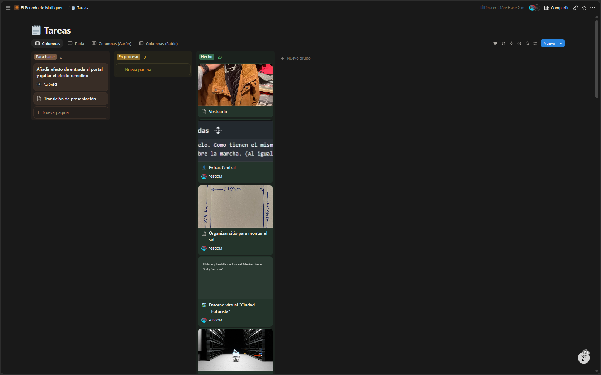
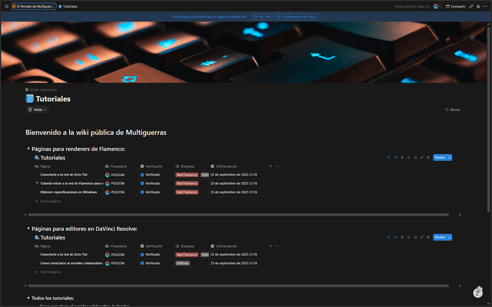

## Guion

El guion fue escrito al 100% por mí, y me fuí basando en ideas que tuve en proyectos anteriores (Como en el proyecto cancelado "El desafío")

Al principio hice un guion bastante más largo de lo que es pero al final lo recorté a lo que es ahora (Quitando escenas como unas del descubrimiento de América o un desenlace final).

Para ese desenlace se barajaron dos finales alternativos: uno apocalíptico (explota el universo), el que el protagonista vuelve a casa y otro de reconciliación. Y al final se acabó con un final abierto

> Un error que cometí fue hacer que los personajes sobreexplicaran lo que estaba pasando en la escena, cuando hay otros medios no verbales de contar la historia.

## Organización

Nada más arrancar el proyecto cree:

- Un canal de Telegram para poder comunicarme con el equipo y subir archivos grandes.
- Una organización de Github (Ver [infraestructura](#infraestructura))
- Notion
### Notion
El notion lo usé para organizar cada toma que se iba a grabar. Cada una tenía unas propiedades que decían si se necesitaba VFX, si requería [Atención Especial](#atencion-especial).

## Decisiones técnicas

### FPS
Los FPS del proyecto son 30, en vez de 24. Creo que esa decisión fue un error.
### SDR vs HDR
Por el momento Blender no soportaba fácilmente espacios de color y en ese momento no tendría un monitor que manejara HDR. Y por eso se decidió que el proyecto fuera SDR.
