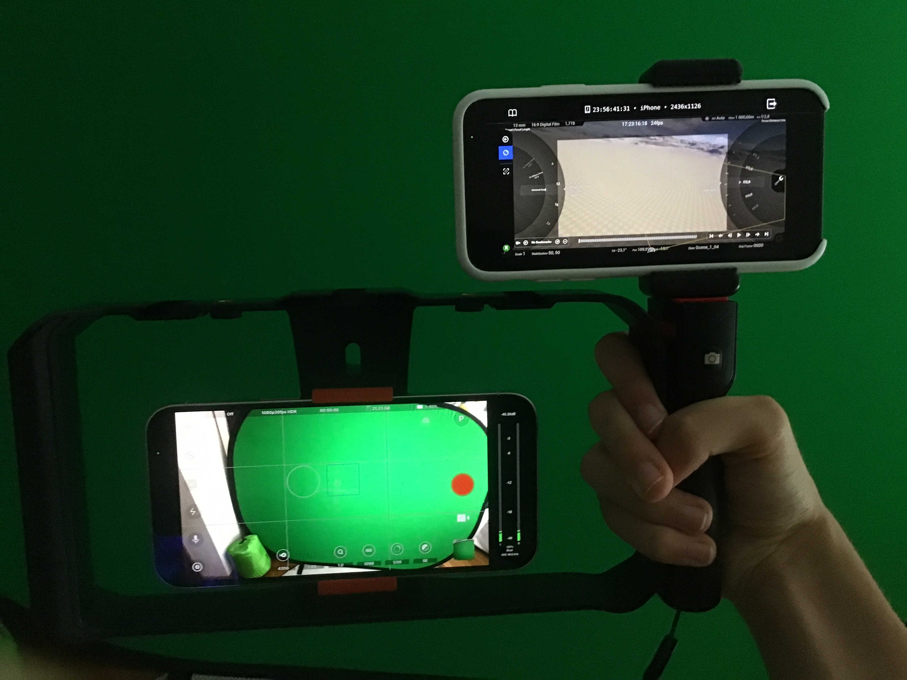
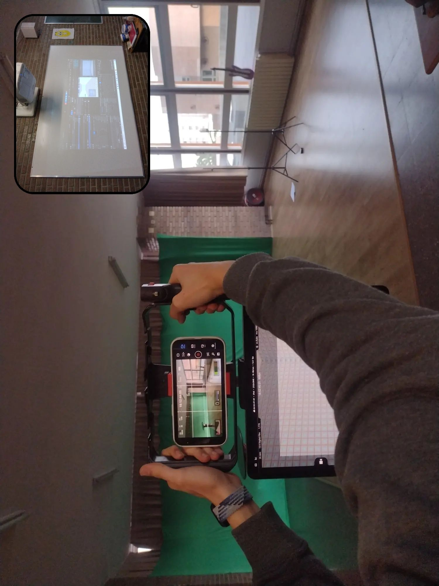
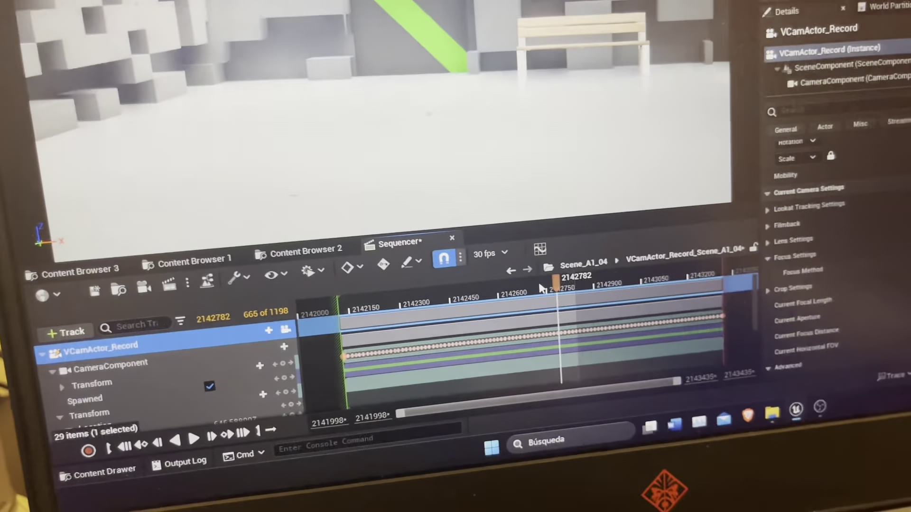

import { Image } from 'astro:assets';
import renderImg from '../../assets/proyectos/multiguerras/render.jpg';
import VideoCompareSlider from '../../components/VideoCompareSlider.astro';

El proyecto empezó a partir de la idea de hacer un cortometraje de producción virtual siguiendo casi la misma idea del [set de la serie Mandalorian](https://youtu.be/Ufp8weYYDE8). Pero en vez de con pantallas, con un chroma, y con menos presupuesto.

## Tracking de cámara

Al pensar como hacer tracking de cámara, se me ocurrió hacerlo con un mando de realidad virtual y conectarlo a Unreal Engine 5 con [Live Link](https://dev.epicgames.com/documentation/unreal-engine/live-link-hub-quick-start-in-unreal-engine). Se podría haber hecho con una pieza personalizada que anclara el mando a nuestra jaula de cámara.

Pero el mando dependería de que las gafas VR estuvieran encendidas, y para eso se necesitaba que las gafas estuvieran en movimiento y con alguien con las gafas puestas. Vi que podría ser más sencillo usar un iPhone con [Unreal VCam](https://apps.apple.com/us/app/unreal-vcam/id1547309663), que es una app que usa ARKit de iOS para hacer tracking de la cámara.

Como se puede ver en la foto, la cámara de abajo estaría dedicada a grabar a los actores y la cámara de arriba sería la cámara virtual con Unreal VCam que capturaría el movimiento de la cámara. Este es el resultado de la primera prueba de tracking de cámara.

<video src="/proyvid/multiguerras/testtracking.mp4" controls preload="none"></video>

Ese pequeño giro fue porque aún no había pensado en cómo sincronizar las cámaras.

Después se me ocurrió que podría sincronizarlo con timecode. Pero no había ninguna aplicación que grabara video con timecode en iOS. Dejé de pensar en ello y dos meses después salió [Blackmagic Camera](https://www.blackmagicdesign.com/es/products/blackmagiccamera), que para mi sorpresa sí que era posible insertar timecode. Además la app permite controlar la cámara en remoto desde otro teléfono y sincronizar/configurar varias cámaras a la vez.

### Calibración de cámaras

Para que la cámara virtual de Unreal tuviera el mismo campo de visión que el iPhone 12 real, hice una hoja de cálculo con el ancho y alto real del sensor de cada lente (principal, 0.5x y 2.5x). Esos valores de sensor los copiaba y pegaba directamente en los parámetros de la cámara de Unreal, así el encuadre virtual coincidía con el de la cámara que graba a los actores.

El sistema de tracking no siempre funcionó bien: hubo tomas donde se perdían keyframes de cámara en pleno rodaje. Cómo detecté el problema y lo recuperé con IA está contado como caso aparte en [Atención especial](#atencion-especial).

## Grabación
En cuanto a la producción virtual, tenía un ordenador portátil con Unreal Engine 5 conectado a una red Wifi el iPhone con Unreal VCam. Y en ese ordenador grababa en un Sequencer de Unreal el movimiento de la cámara virtual para posteriormente revisar si en algún punto la cámara virtual se desconectó y también añadir animaciones adicionales a la escena.

### Emparejamiento de tomas reales y virtuales
Las tomas las emparejo a partir de los metadatos escena y toma. (La ID de la escena que se graba en Unreal se empareja con la escena que tiene la misma escena en el iPhone) y las sincronizo a partir del timecode, para lo cual en Unreal Engine tuve que hacer un [script](https://github.com/multiguerras/TimecodeUnreal) que generara un CSV con todos los metadatos para importarlos a DaVinci Resolve para montarlos.

| File Name                         | Scene | Take | Start TC    |
|-----------------------------------|-------|------|-------------|
| Scene_G1_02.[1416805-1418152].exr | G1    | 02   | 13:07:06:25 |
| Scene_H1_01.[1184728-1187235].exr | H1    | 01   | 10:58:10:28 |
| Scene_H2_02.[1198679-1199668].exr | H2    | 02   | 11:05:55:29 |
| Scene_H3_01.[1205949-1207010].exr | H3    | 01   | 11:09:58:09 |
| Scene_H4_01.[1211621-1213227].exr | H4    | 01   | 11:13:07:11 |
| Scene_H5_01.[1221223-1226111].exr | H5    | 01   | 11:18:27:13 |

## Movie Render Queue

Todas estas escenas de sequencer, para renderizarlas, añadía varias a una Render Queue de Unreal con una configuración especial que renderiza los EXR con los metadatos necesarios en el nombre del frame (Escena, Toma y Timecode) para luego [el script](https://github.com/multiguerras/TimecodeUnreal) pueda trabajar.

<Image src={renderImg} alt="Proceso Render de Unreal Engine" width={400} />

### Render Farm de Unreal
Al principio pensé en ejecutar una renderfarm de Unreal Engine para renderizar el proyecto, pero al final no fue necesario porque conseguí un ordenador mejor y pudo renderizar todo el proyecto en 20 horas. Modifiqué un [programa existente](https://github.com/leixingyu/unrealRenderFarm) para que pudiera funcionar en Unreal Engine 5. Este es [el fork](https://github.com/multiguerras/unrealRenderFarmMultiguerras).
