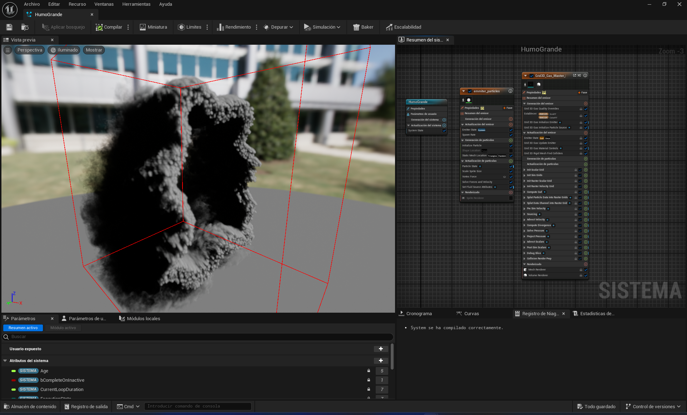
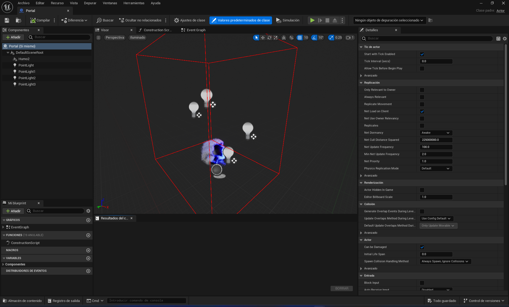
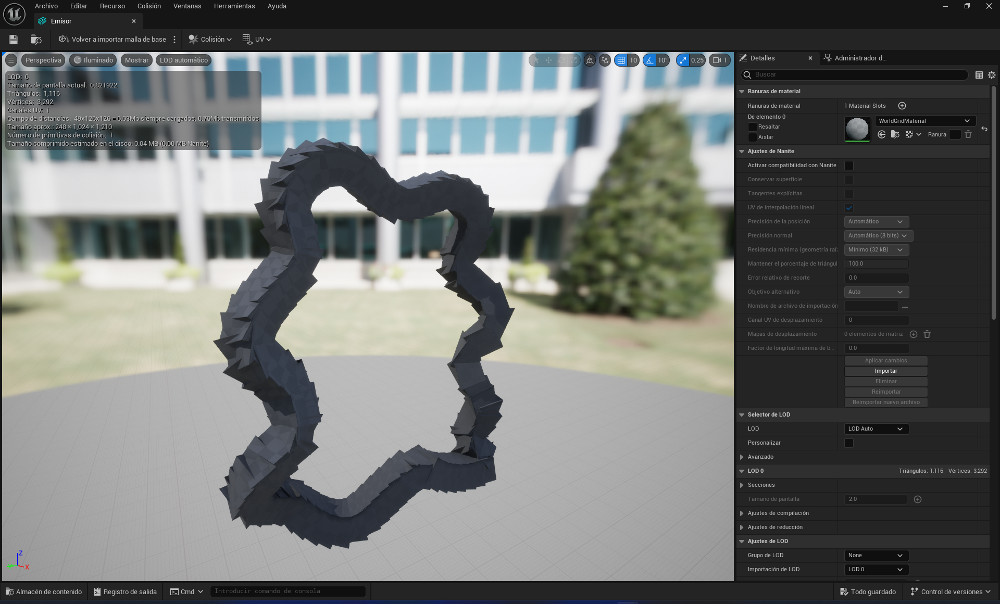
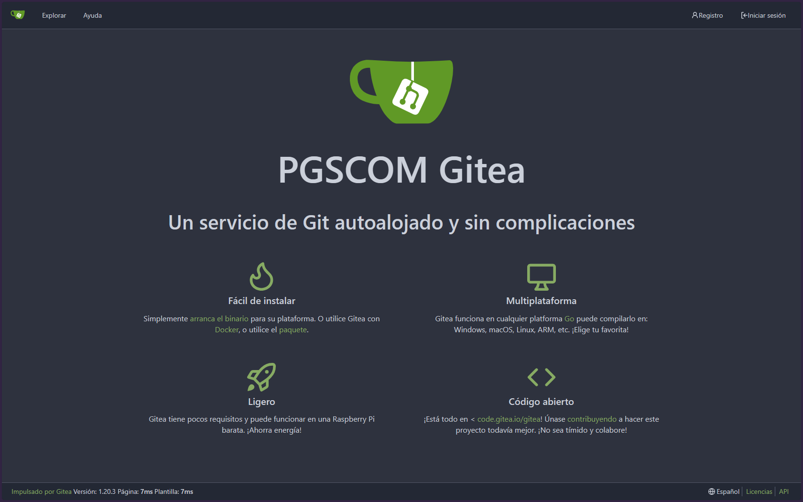
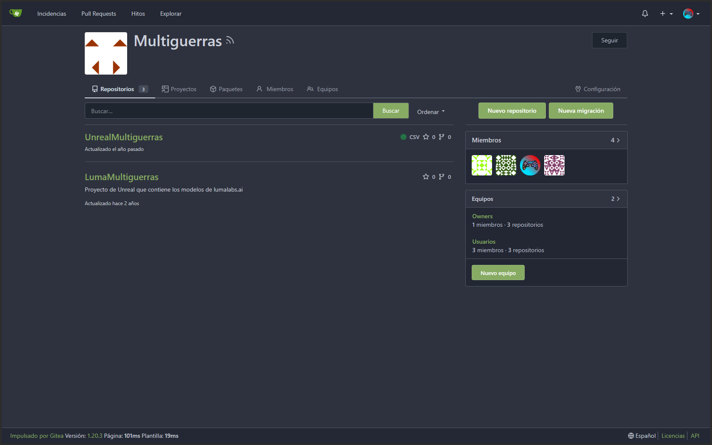
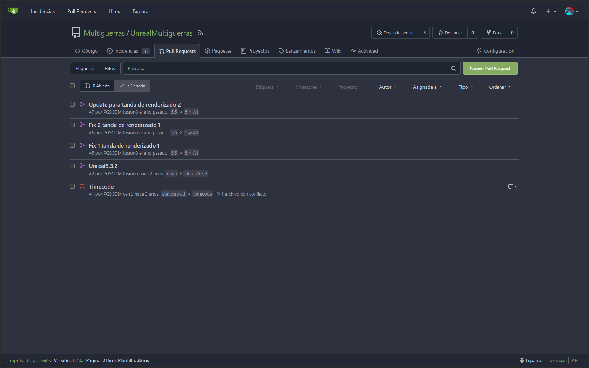
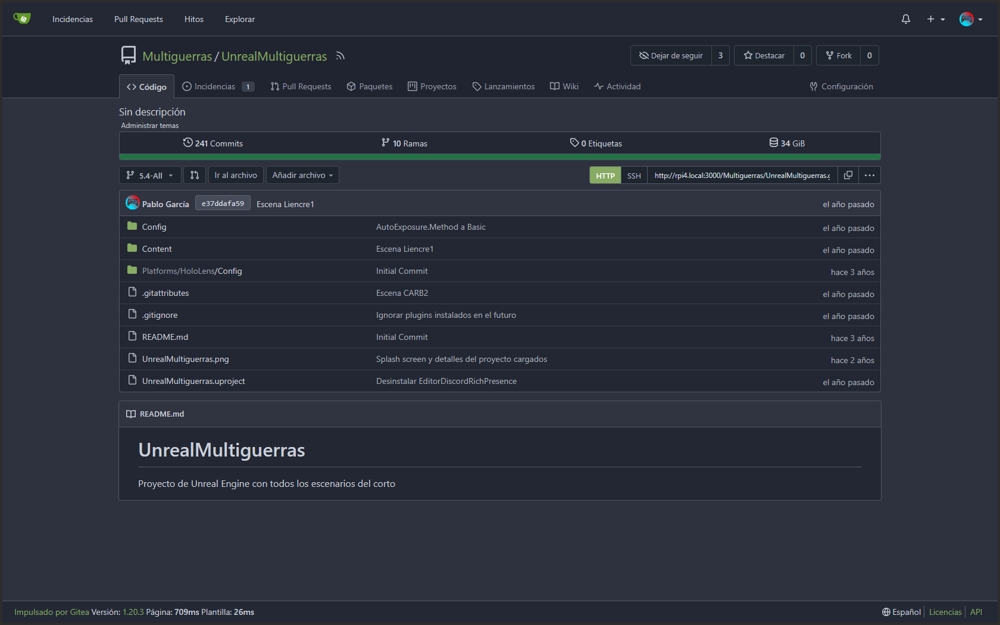
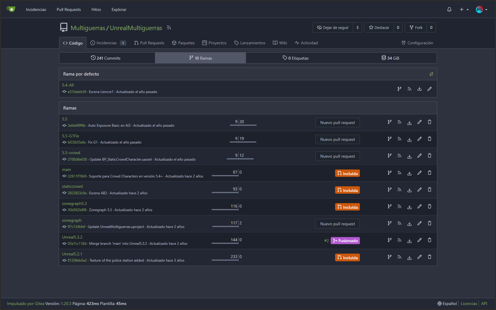
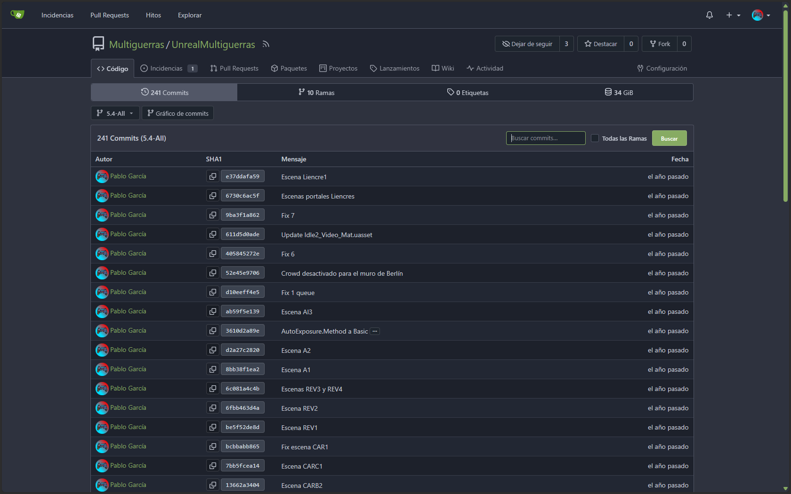

Como Unreal Engine fue el núcleo de la [producción virtual](#produccion-virtual) del cortometraje, tuve que desarrollar muchas cosas aparte de ello.

## Portales
Como en Blender es demasiado pesado renderizar el portal, tuve que hacer una versión de él en Unreal.

Lo hice con el sistema de físicas Niagara Fluids importando la mesh que montaba el [portal de Blender](#portal-en-blender). Y después lo metí en un Blueprint Class junto a su iluminación para crear un Blueprint instanciable.

<video controls src="/proyvid/multiguerras/portalunreal.mp4"></video>

## Extras digitales

### Extras andantes

Al principio, usé los personajes y animaciones de [Mixamo](https://mixamo.com/) que colocaba manualmente en cada escena.

<video controls src="/proyvid/multiguerras/crowdv0.mp4"></video>

Pero eso no era escalable, así que investigando un poco más, vi que [una demo de Unreal](https://www.fab.com/listings/903037e9-e1ac-4f41-96e8-1683c6fa7ad4) ya usó un sistema de crowd procedural. Y con un [tutorial](https://youtu.be/2LvUB3_PAhI) conseguí ejecutarlo en mi proyecto.

Lo chulo del sistema es que a parte de que el movimiento es procedural (Trazando rutas en el editor), también la vestimenta de los personajes lo es, así que ningún personaje es igual.
Este sistema lo usé en las escenas del Muro de Berlín y las de la central.

> Durante el proyecto me encontré con un bug real del motor: en Unreal Engine 5.3 los extras caían atravesando el suelo, y en la 5.4 (sin cambiar nada más) funcionaba correctamente. Por este motivo, parte del corto quedó renderizada en 5.3 y otra en 5.4.

<video controls src="/proyvid/multiguerras/crowdv1.mp4"></video>

### Multitud estática
Para las últimas escenas del Muro de Berlín, usé el sistema anterior como base pero modificando la animación e inserté el blueprint en un PCG Graph con ayuda de [otro tutorial](https://youtu.be/CVBJN4fTzUo).

<video src="https://pgscom-media-web.pages.dev/crowdmuroberlin/playlist.m3u8" poster="https://pgscom-media-web.pages.dev/crowdmuroberlin/miniatura.png" controls preload="none" style="width: 40%;"></video>

Gracias a esto hice que la multitud se generara proceduralmente en un area concreta con rotación y posición variada y también con animaciones diferentes.

## MetaHuman

En algunas ocasiones pensé en hacer dobles digitales de los actores, al final no hizo falta, pero sí que hice los MetaHuman mediante los datos de profundidad de LiveLink Face.

Cada MetaHuman pesaba unos 7 GB y al final casi no los usé.

<video src="https://pgscom-media-web.pages.dev/metahumanfreiheit/playlist.m3u8" poster="https://pgscom-media-web.pages.dev/metahumanfreiheit/miniatura.png" controls preload="none"></video>

## Cámara virtual y tracking
(Ver también [Producción Virtual](#produccion-virtual))

La cámara virtual se tenía que encajar con la cámara real. Para ello tenía unos presets para la cámara de Unreal con los parámetros de cada cámara de mi iPhone.

## Renderizado
Después se renderizaban las escenas de Unreal como secuencias EXR y las importaba a Resolve junto a los metadatos generados (Todo esto explicado en [su sección de Producción Virtual](#emparejamiento-de-tomas-reales-y-virtuales)).

## Control de versiones

Para colaborar con otra gente y tener un control de versiones metí el proyecto entero en un repositorio de Git con Git LFS en la RPI4 con Gitea (Mencionado en [la sección de infraestructura](#servicios)).

Llegué a acumular 241 commits y el proyecto ocupaba 34 GB aprox. Esto me hizo darme cuenta de que Git no era la mejor opción para proyectos de Unreal, y que opciones como Perforce se usan más en la industria por esa razón. Pero como fue un proyecto en el que no colaboré mucho con otras personas, cumplió su función como control de versiones y también como backup del proyecto al estar clonado en todos los ordenadores.

<iframe src="/graphgiteamultiguerras.html" width="100%" height="450" frameborder="0"></iframe>

## Assets y referencias

- Quixel Megascans: texturas/rocas escaneadas (cajas eléctricas, etc.)
- Ciudad de Berlín: pack descargado (el muro sí es modelado propio, ver Blender)
- Mapa de bosque y VFX de la "bola de teletransporte": reutilizados de tech-demos oficiales de Unreal
- Crowd procedural: adaptado de una demo pública de Unreal + tutoriales
- Personajes/animaciones base: Mixamo