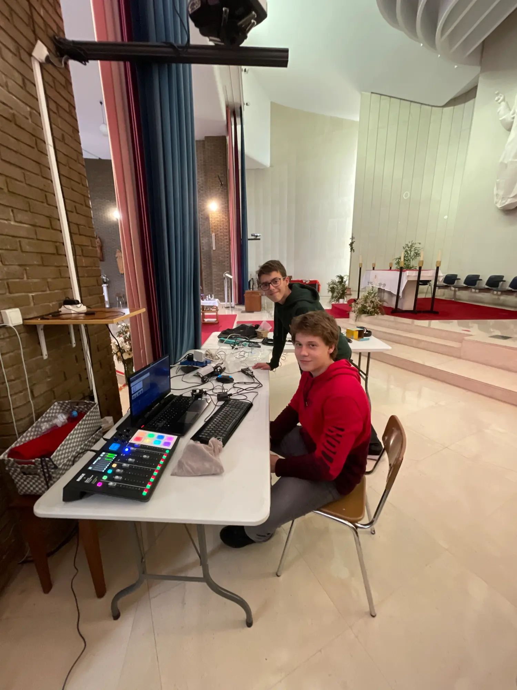
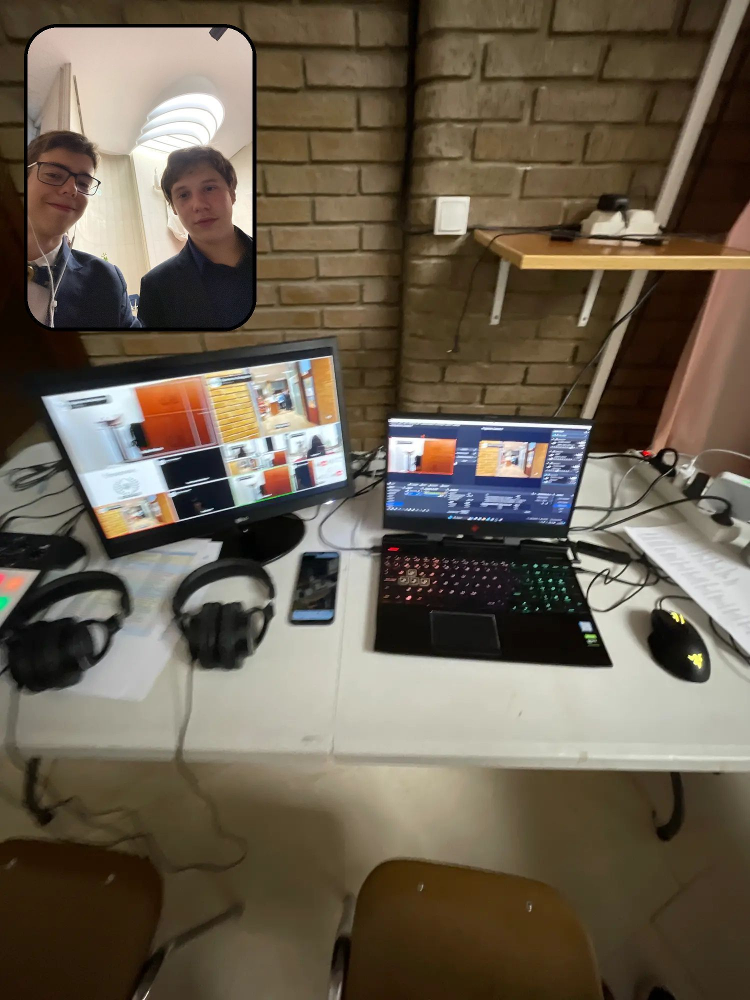
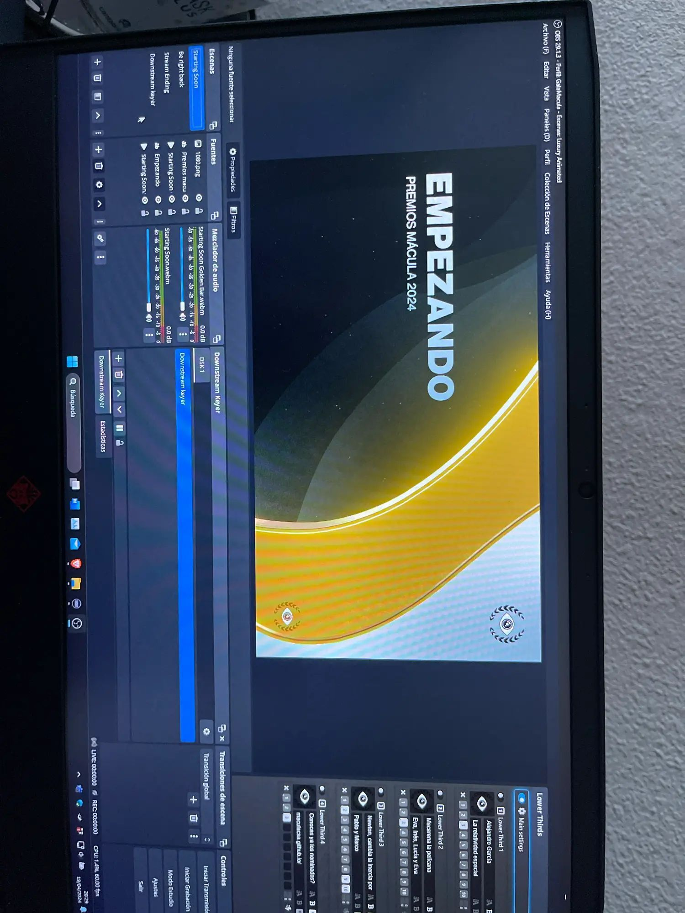
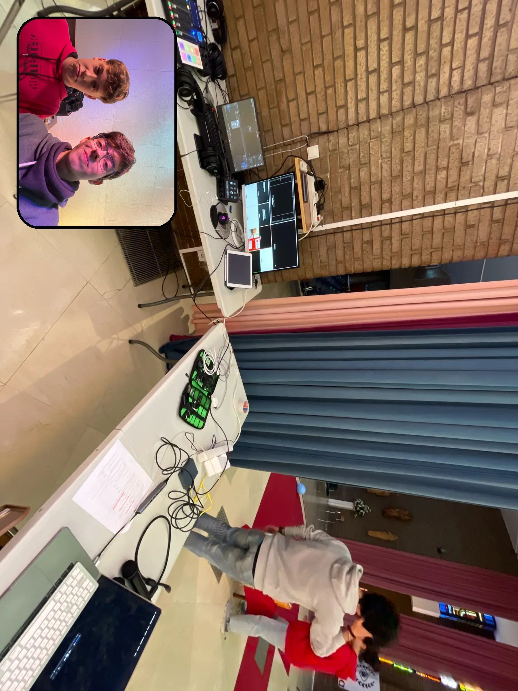
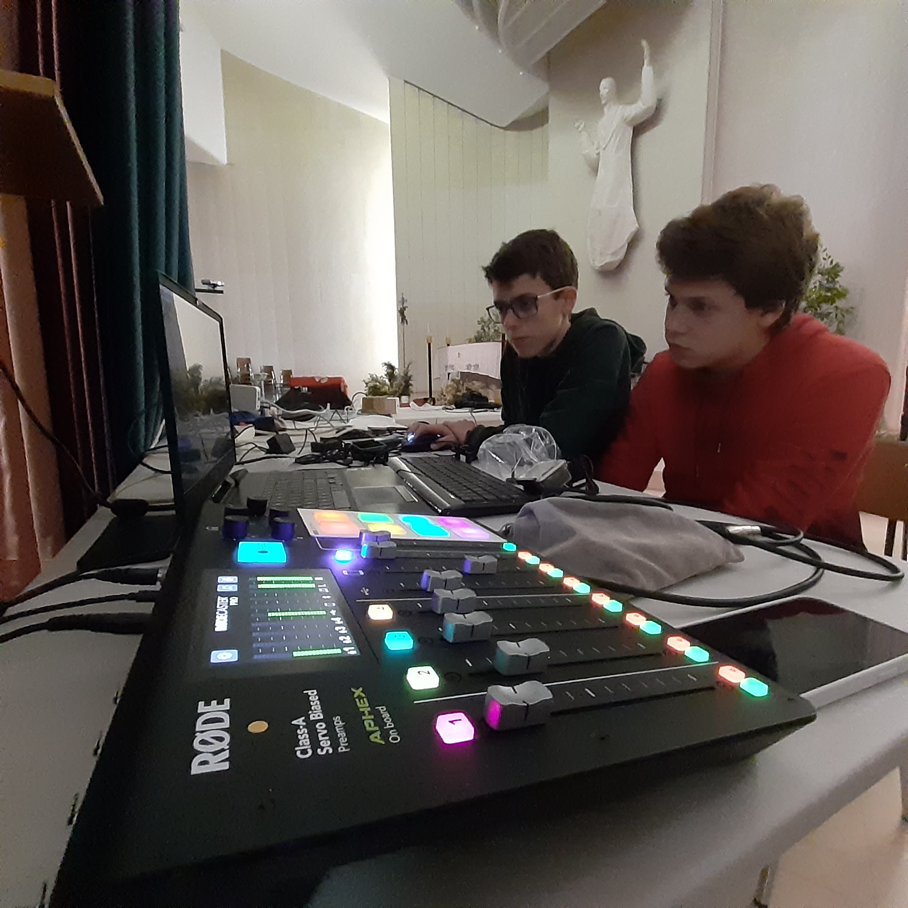
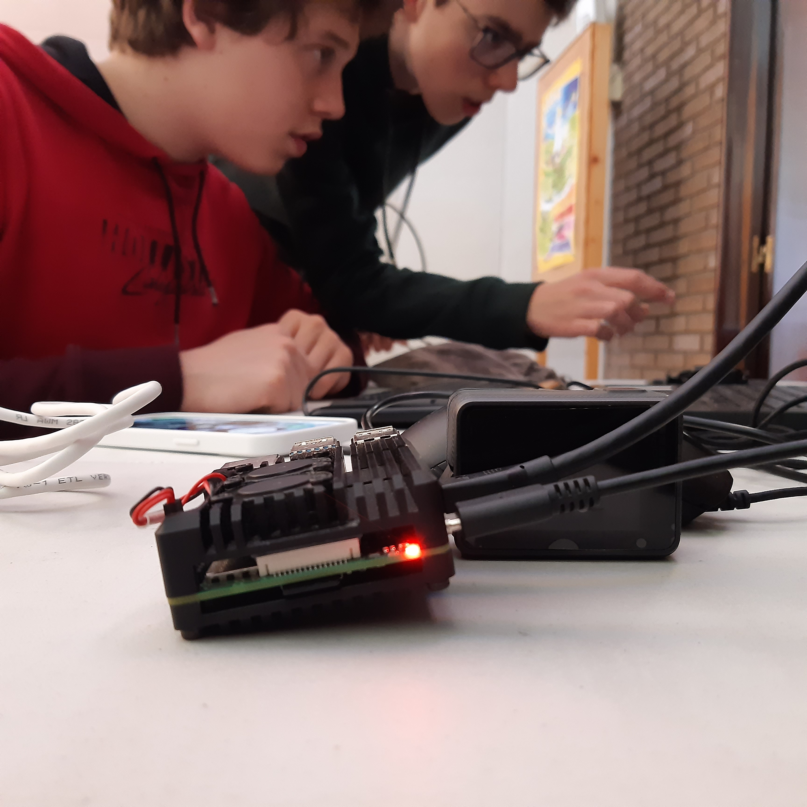
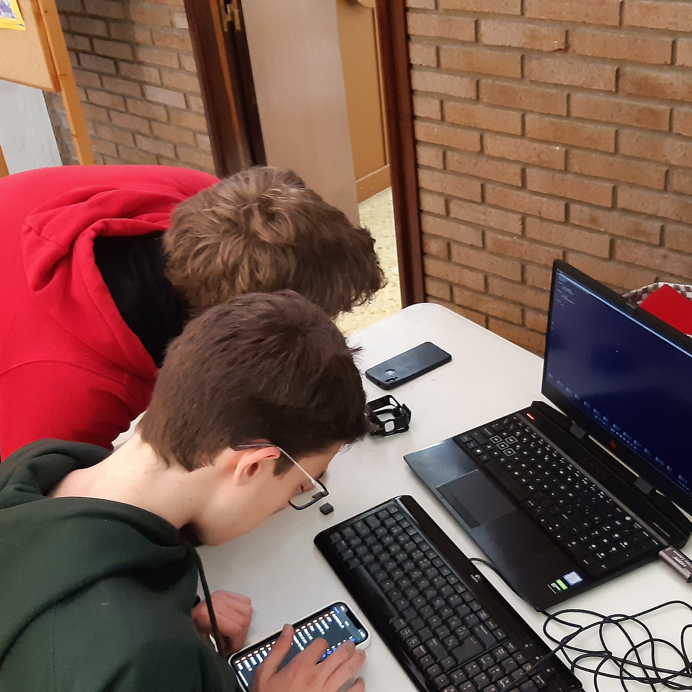
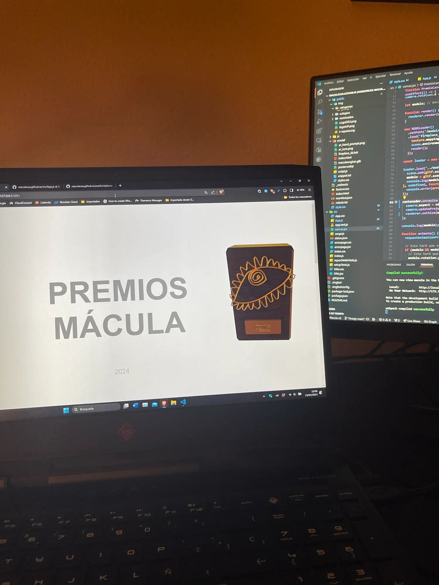
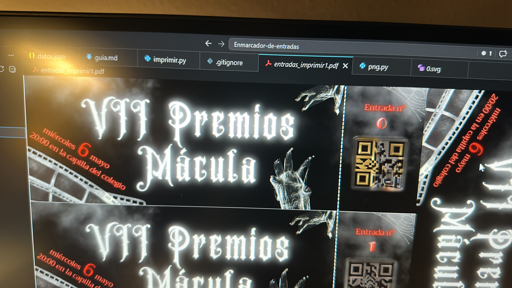

### ¿Qué es este proyecto?

Los Premios Mácula son una gala de premios de cortometrajes hechos por los alumnos del Colegio San Agustín de Santander. Yo me ofrecí a ayudar desde 2022 con el streaming en directo junto a un compañero mío (Aarón Sancibrián). Y desde entonces, fuí añadiendo mis aportaciones al proyecto interno.

 

Laura Madrigal, Jorge Herrán, Javier Galván y demás personas encargadas de este proyecto en el Colegio San Agustín de Santander, gracias por dejarnos ayudar en este proyecto.

<h2 data-tab="video">Streaming</h2>

El sistema que tenían anteriormente era muy rudimentario, eran dos ordenadores haciendo 2 streaming por separado en YouTube sin conexión de los micrófonos.

A partir de esa idea, propuse un sistema con OBS Studio y [vdo.ninja](https://github.com/steveseguin/vdo.ninja)

### Sistema de cámaras
A partir del proyecto vdo.ninja que conocía anteriormente, el Streaming podría tener varias cámaras simultaneas y conectadas mediante WebRTC (P2P) a OBS gracias a vdo.ninja. Para tener mayor estabilidad, también puse un router que posteriormente se cambió a una red mesh para mejorar la conexión al ordenador.

### Audio
El audio produjo muchos problemas en todas las galas. Ya que el sistema de audio del colegio no estaba preparado para tener una salida hacia un ordenador y simultaneamente al altavoz original.

Problemas en directo

- En 2022 hubo problemas de conexión a internet por un cable defectuoso y fue necesario usar un móvil y la red 4G para poder retransmitir, aunque con cortes y retrasos.

- En 2024 falló el cable de retorno del sonido y se improvisó con un altavoz Bluetooth.

- En 2025 se incorporaron micrófonos inalámbricos para reducir fallos de audio.

- En 2026 se cambió el sistema de audio, pero siguieron los problemas para enviar el sonido al ordenador y la solución improvisada no funcionó.

### Video sistemas 2025
<video src="https://pgscom-media-web.pages.dev/detrasmacula2025/master.m3u8" poster="https://pgscom-media-web.pages.dev/detrasmacula2025/miniatura.png" controls preload="none"></video>

### Galería

<video src="/proyvid/macula/tomageneral2024.mp4" muted preload="none"></video>

<video src="/proyvid/macula/tomageneral2025.mp4" muted preload="none"></video>

<h2 data-tab="programacion">Web</h2>

[Visitar premiosmacula.es →](https://premiosmacula.es)

Al ver que no había una manera facil de  acceder a todos los cortometrajes y ver sus nominados, se me ocurrió hacer una página web para poder ver los cortometrajes.

La primera versión fue la de [2023](https://premiosmacula.es/2023/) ([Código Fuente](https://github.com/MaculaCSA/maculacsa.github.io/tree/v1)) que era una página web más o menos simple donde en la versión de escritorio se podía ver una animación con un video mientras se hace scroll.

Al año siguiente ví que había que hacer que se pueda actualizar de forma facil y que se pueda ver los cortometrajes nominados de años pasados. Con esa idea hice desde cero una versión con React y con un script que monta la página web a partir de los datos de un [.json](https://github.com/MaculaCSA/maculacsa.github.io/tree/main/src/datos).

Esta es la versión actual: https://premiosmacula.es ([Código Fuente](https://github.com/MaculaCSA/maculacsa.github.io))

<h2 data-tab="programacion">Entradas</h2>

### Generación de entradas
Para poder generar entradas con QRs únicos he hecho [multiples scripts en Python](https://github.com/MaculaCSA/Enmarcador-de-entradas) que a partir de un diseño en SVG, se generan varias entradas con los QRs generados a partir de un .txt con IDs generadas aleatoriamente.

#### QRs generados por IA
Con [ComfyUI](https://comfy.org/) hice un workflow para sustituir [la generación de QRs antigua](https://github.com/MaculaCSA/Generador-de-QR) para que cada QR tenga un diseño único.

### Validación
Hice un sistema muy simple para poder validar las entradas de los asistentes. Consistía en una App programada con App Inventor que se conectaba a una base de datos en Firebase.

<video src="/proyvid/macula/entrada-escaneada.mp4" style="height: 70vh" controls preload="none"></video>

<h2 data-tab="vfx">Escena de introducción</h2>
Animación de introducción para el streaming.

<video src="https://pgscom-media-web.pages.dev/intro-macula/master.m3u8" poster="https://pgscom-media-web.pages.dev/intro-macula/miniatura.png" controls preload="none"></video>

## Detrás de cámaras

<video src="/proyvid/macula/btsintromacula.mp4" controls preload="none"></video>
Son varias escenas en donde se copian los parámetros del material del fondo y la posición de la cámara para que no se note el corte.

El fondo está hecho con un generador de ruido conectado al color pasando por un filtro dorado y también conectado al nodo de desplazamiento.

